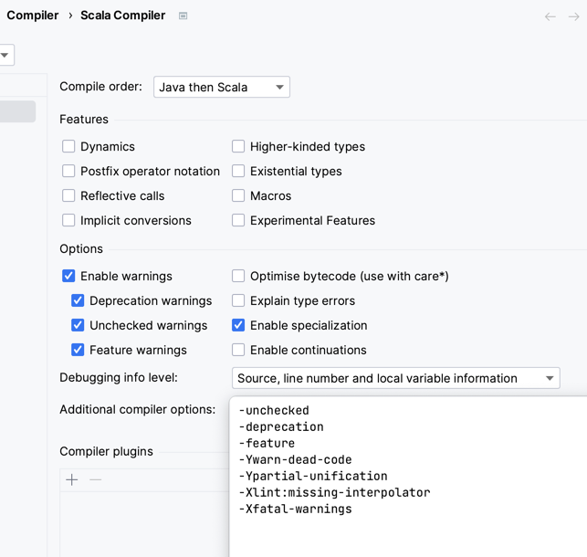

# Koski

Koski toimii kattavana opetustoimialan tietovarantona, joka tarjoaa
tutkintoon johtavat suoritustiedot eri koulutusasteilta. Yleinen Koski-dokumentaatio kootaan [wikiin](https://wiki.eduuni.fi/display/OPHPALV/Koski).

Tässä git-repositoriossa on Koski-järjestelmän ohjelmakoodi, tietokannan rakennuslausekkeet ja tekninen dokumentaatio ohjelmistokehitystä varten.

Koski on [EUPL](LICENSE.txt)-lisensoitu sovellus, josta on mahdollista käynnistää kehitysinstanssi omalla työasemalla, alla olevien kehitysohjeiden mukaisesti. Koski-sovellus on alustariippumaton, sillä se pyörii Java-virtuaalikoneella. Kehitysympäristö toimii sellaisenaan ainakin Linux ja OSX-käyttöjärjestelmissä.

## Valpas

Kosken kanssa tässä samassa git-repositoriossa on myös Valpas-palvelun toteutus. Valpas on oppivelvollisuuden valvontapalvelu, joka käyttää mm. Koski-tietovarannon tietoja. Yleinen Valpas-dokumentaatio on [wikissä](https://wiki.eduuni.fi/display/OPHPALV/Valpas-palvelu). Valppaan käyttöliittymän toteutuksesta on erillinen [README.md](valpas-web/README.md).

## Käsitteet

Keskeiset entiteetit, ja järjestelmät, joihin nämä tallennetaan.

| käsite         | selite                                                                                                                       | tunniste        | tallennuspaikka     |
| -------------- | ---------------------------------------------------------------------------------------------------------------------------- | --------------- | ------------------- |
| Koodisto       | Kooditus objekteille, esim tutkintonimikkeet                                                                                 | id (tekstiä)    | Koodistopalvelu     |
| Koodi          | Yksittäisen objektin koodi koodistossa                                                                                       | id (tekstiä)    | Koodistopalvelu     |
| Oppija         | Opiskelija, oppilas.                                                                                                         | henkilöOid      | Henkilöpalvelu      |
| Organisaatio   | Oppilaitos, kunta, eri rooleissa                                                                                             | organisaatioOid | Organisaatiopalvelu |
| Opiskeluoikeus | Oppijan suhde oppilaitokseen ja suoritettavaan tutkintoon (tutkinto, oppija, oppilaitos, voimassaoloaika, läsnäolotiedot...) | id (numeerinen) | Koski               |
| Peruste        | Tutkinnon tai tutkinnon osan peruste                                                                                         | diaarinumero    | ePerusteet          |
| Suoritus       | Oppijan suoritus (tutkinto, oppija, oppilaitos, aika...)                                                                     | id (numeerinen) | Koski               |
| Tutkinto       | Tutkinnon kuvaus (tutkintotunnus, nimi...)                                                                                   | tutkintotunnus  | Koodisto            |

## Käyttäjän kirjautuminen ja käyttöoikeudet

Koski sallii käytön, jos

A CAS-palvelu sallii kirjautumisen käyttäjän syöttämällä käyttäjätunnuksella ja salasanalla, tai
B Kosken REST-rajapintoja käytettäessä HTTP-pyynnössä on HTTP Basic Authentication -käyttäjätunnus ja salasana, jotka ovat validit Opintopolun käyttöoikeuspalvelussa.

Käyttäjä kuuluu käyttöoikeusryhmiin, joiden kautta hänelle määräytyvät hänen käyttöoikeutensa (roolit) Koskessa.
Käyttäjän käyttöoikeudet haetaan Opintopolun käyttöoikeuspalvelusta. Käyttöoikeudet muodostuvat kolmesta osasta:

- Sovellus: joko KOSKI, LOKALISOINTI tai VALPAS,
- Rooli: kertoo käyttäjäoikeustyypin, ja
- Oid: organisaation oid-tunniste.

Esimerkki arvosta:

> KOSKI READ_UPDATE 1.2.246.562.10.48002002061

Tämä määrittää Kosken käyttäjälle luku- ja kirjoitusoikeuden organisaatioon, jonka oid-tunnus on 1.2.246.562.10.48002002061.

Tuetut yhdistelmät sovellus, rooli ja oid -parametreille:

| sovellus     | rooli                     | oid                                      | selite                                                                                                                                                                               |
| ------------ | ------------------------- | ---------------------------------------- | ------------------------------------------------------------------------------------------------------------------------------------------------------------------------------------ |
| KOSKI        | READ                      | (organisaation oid)                      | Organisaatiokohtainen lukuoikeus                                                                                                                                                     |
| KOSKI        | READ_UPDATE               | (organisaation oid)                      | Organisaatiokohtainen luku- ja kirjoitusoikeus. Kirjoittamiseen tarvitaan aina myös alla oleve LUOTTAMUKSELLINEN-rooli.                                                              |
| KOSKI        | LUOTTAMUKSELLINEN         | (organisaation oid)                      | Oikeus katsella luottamukselliseksi määriteltyjä tietoja (ks. @SensitiveData -annotaatio). Tämä rooli vaaditaan aina myös tiedon kirjoittamiseen.                                    |
| KOSKI        | TIEDONSIIRRON_MITATOINTI  | (organisaation oid)                      | Oikeus mitätöidä myös tiedonsiirron kautta siirrettyjä tietoja (käsin syötettyjen tietojen mitätöintiin riitää READ_UPDATE).                                                         |
| KOSKI        | TIEDONSIIRTO              | (organisaation oid)                      | Organisaatiokohtainen Kosken API:n palvelukäyttö                                                                                                                                     |
| KOSKI        | OPHKATSELIJA              | (OPH:n organisaation oid)                | Globaali lukuoikeus kaikkiin organisaatioihin, jos _oid_ on OPH:n organisaation oid                                                                                                  |
| KOSKI        | OPHPAAKAYTTAJA            | (OPH:n organisaation oid)                | Globaali luku- ja kirjoitusoikeus kaikkiin organisaatioihin, jos _oid_ on OPH:n organisaation oid                                                                                    |
| KOSKI        | GLOBAALI_LUKU_PERUSOPETUS | (Viranomaisen organisaation oid)         | Globaali lukuoikeus kaikkien organisaatioiden perusopetuksen opiskeluoikeuksiin                                                                                                      |
| KOSKI        | GLOBAALI_LUKU_TOINEN_ASTE | (Viranomaisen organisaation oid)         | Globaali lukuoikeus kaikkien organisaatioiden toisen asteen opiskeluoikeuksiin                                                                                                       |
| KOSKI        | GLOBAALI_LUKU_KORKEAKOULU | (Viranomaisen organisaation oid)         | Globaali lukuoikeus kaikkien organisaatioiden korkeakoulutuksen opiskeluoikeuksiin                                                                                                   |
| LOKALISOINTI | CRUD                      | (OPH:n organisaation oid)                | Lokalisointitekstien lukeminen ja muuttaminen Kosken API:n kautta, jos _oid_ on OPH:n organisaation oid                                                                              |
| VALPAS       | OPPILAITOS_HAKEUTUMINEN   | (koulutustoimijan tai oppilaitoksen oid) | Oikeus valvoa oppilaitoksen oppijoiden hakeutumista jatko-opintoihin peruskoulun tai nivelvaiheen opintojen jälkeen ja tehdä tarvittaessa ilmoituksia kunnalle                       |
| VALPAS       | OPPILAITOS_HAKEUTUMINEN   | (OPH:n organisaation oid)                | Oikeus valvoa kaikkien oppilaitosten peruskoulun ja nivelvaiheen oppijoiden hakeutumista                                                                                             |
| VALPAS       | OPPILAITOS_SUORITTAMINEN  | (koulutustoimijan tai oppilaitoksen oid) | Oikeus valvoa oppilaitoksen oppijoiden oppivelvollisuuden suorittamista nivelvaiheen ja toisen asteen opinnoissa ja tehdä tarvittaessa ilmoituksia kunnalle                          |
| VALPAS       | OPPILAITOS_SUORITTAMINEN  | (OPH:n organisaation oid)                | Oikeus valvoa kaikkien oppilaitosten oppijoiden oppivelvollisuuden suorittamista                                                                                                     |
| VALPAS       | OPPILAITOS_MAKSUTTOMUUS   | (organisaation oid)                      | Oikeus hakea tiedot sen päättämiseen, saako oppija suorittaa peruskoulun jälkeisiä opintoja maksuttomasti vai ei                                                                     |
| VALPAS       | KUNTA                     | (kuntaorganisaation oid)                 | Oikeus valvoa oppivelvollisia oppijoita oppilaitosten tekemien ilmoitusten tai oppijan henkilötunnuksen tai oppijanumeron perusteella ja hallita oppivelvollisuuden keskeytystietoja |
| VALPAS       | KUNTA                     | (OPH:n organisaation oid)                | Kunnan oikeudet kaikkiin kuntiin.                                                                                                                                                    |

Lähdekoodissa [MockUsers](src/main/scala/fi/oph/koski/koskiuser/MockUsers.scala) on käyttäjät testitarkoituksia varten. Koski-palvelu käyttää niitä, jos Koski on käynnistetty konfiguraatiolla `opintopolku.virkailija.url = "mock"` (katso [Konfigurointi](#konfigurointi)). Tätä voi käyttää ajaessa Koskea lokaalisti.

Valppaan testikäyttäjistä on tietoa Valppaan käyttöliittymän [README.md:ssä](valpas-web/README.md).

## Teknologiat

Nämä ovat keskeiset Koski-järjestelmässä käytettävät teknologiat. Lista kuvaa järjestelmän nykytilaa ja muuttuu matkan varrella
tarpeen mukaan.

- PostgreSQL 12.5 -tietokanta
- OpenSearch -hakuindeksi
- Palvelinteknologiat
  - Scala 2.12 -ohjelmointikieli ja kääntäjä
  - Node.js 16.19.0 -runtime
  - Scalatra-web-framework
  - [Slick](http://slick.typesafe.com/doc/3.0.1/index.html)-relaatiokantakirjasto
  - Flyway-migraatiotyökalu kannan skeeman rakentamiseen ja päivittämiseen kehityksessä ja tuotannossa
  - Maven-build-työkalu kehityskäyttöön ja asennettavan paketin rakentamiseen
  - Maven-riippuvuuksien lataus Jitpackilla, jolloin voidaan viitata suoraan Github-repoihin, eikä tarvitse itse buildata jar-artifaktoja
  - Integraatiot Opintopolku-palveluihin, kuten organisaatio- ja henkilöpalveluun REST-rajapinnoilla, käyttäen http4s-clienttiä
- Web-sovelluksen frontend-teknologiat
  - npm-työkalu riippuvuuksien hakuun
  - Webpack bundlaukseen
  - TypeScript
  - React
  - Bacon.js
  - LESS
  - Selainyhteensopivuus IE11-selaimesta moderneihin selaimiin
- Koko järjestelmän buildaus Make-työkalulla, joka delegoi yksittäiset toiminnot eri työkaluille, kuten Maven ja npm

## Kehitystyökalut

Minimissään tarvitset nämä:

- Git (osx, linux sisältää tämän, komentorivillä `git`)
- GNU Make (osx, linux sisältää tämän, komentorivillä `make`)
- JDK 11 (osx: `brew tap homebrew/cask-versions`
  `brew install temurin11 --cask`)
  - Muista asettaa `JAVA_HOME` viittaamaan äsken asennetun Javan polkuun, että maven ja sbt osaavat käyttää oikeaa versiota.
- Maven 3 (osx: `brew install maven`)
- Node.js (`.nvmrc`-tiedoston mukainen versio)
- Docker PostgreSQL:n ja OpenSearchin ajamiseen konteissa
- Tekstieditori (kehitystiimi käyttää IntelliJ IDEA)

### Scala-kääntäjän konfiguraatio

Esim. IntelliJ IDEAn Scala-kääntäjän konfiguraatio kannattaa asettaa seuraavasti:



## Buildi ja ajaminen

Kosken buildiin kuuluu frontin buildaus (npm ja webpack) ja serverin buildaus Mavenilla. Tätä helpottamaan on otettu käyttöön `make`, jonka avulla eri taskit on helppo suorittaa. Katso [Makefile](Makefile)-tiedosto.

Buildaa koko systeemi

```shell
make build
```

Buildaa frontti, ja päivitä automaattisesti kun tiedostoja muokataan:

```shell
make watch
```

Staattinen analyysi ([ScalaStyle](http://www.scalastyle.org/) ja [ESLint](http://eslint.org/)):

```shell
make lint
```

Kosken versioitu paketti tehdään kopioimalla versionhallinnassa olevat tiedostot hakemistoon `target/dist` ja buildaamalla applikaatio uudelleen siellä ([dist.sh](scripts/dist.sh)). War-pakettiin päätyy siis lopulta `target/dist/target/webapp`-hakemiston sisältö.

### Koski-sovelluksen ajaminen paikallisesti

Aja JettyLauncher-luokka IDEAsta/Eclipsestä, tai käynnistä Koski vaihtoehtoisesti komentoriviltä

```shell
make build
make run
```

Avaa selaimessa [http://localhost:7021/koski/virkailija](http://localhost:7021/koski/virkailija). Selaimeen avautuu login-sivu, josta pääset eteenpäin käyttäjätunnuksella "kalle". Salasana on sama kuin käyttäjätunnus.

Näin ajettuna sovellus käyttää paikallista PostgreSQL-kantaa ja OpenSearch-hakuindeksiä, jotka voi käynnistää docker-composella. Sovellus ei myöskään käytä mitään ulkoisia palveluja. Sillä on siis turvallista leikkiä.

Paikallisesti ajettaessa Jetty lataa resurssit hakemistosta `target/webapp`, jonka sisältö luodaan webpack-buildilla ([webpack.config.js](web/webpack.config.js)). Webpack-build muun muassa kopioi staattisia resursseja paikoilleen
hakemistosta [`web/`](web/) ja sen alihakemistoista.

Staattisista tiedostoista palvellaan vain `web.xml` -tiedostossa erikseen määritellyt polut.
Tietyt polut ohjataan palvelemaan etusivun sisältö, ks. [ScalatraBootstrap](src/main/scala/ScalatraBootstrap.scala) ja [IndexServlet](src/main/scala/fi/oph/koski/servlet/IndexServlet.scala).

Raporttien käyttö paikallisesti tarvitsee raportointikannan. Sen saa luotua komentoriviltä

```shell
make reset-raportointikanta
```

### Ajaminen paikallisesti käyttäen ulkoisia palveluja

Ilman parametrejä ajettaessa Koski käyttää mockattuja versioita ulkoisista riippuvuuksista.

Ottaaksesi käyttöön ulkoiset integraatiot, kuten Oppijanumerorekisterin, voit antaa Koskelle käynnistysparametrinä käytettävän konfiguraatiotiedoston sijainnin. Esimerkiksi

```
-Dconfig.resource=qa.conf
```

Tällä asetuksella käytetään tiedostoa `src/main/resources/qa.conf`. Tämä tiedosto ei ole versionhallinnassa, koska se sisältää ei-julkista tietoa.

### Kehitysympäristön tietokannat

Kehityskäyttöön tarvitaan PostgreSQL-tietokanta ja OpenSearch-hakuindeksi.

Kehitystietokannat käynnistetään docker-composella. Tämän voi tehdä seuraavalla
komennolla:

```shell
make docker-dbs
```

Kehityksessä käytetään kolmea kantaa: `koski`, `valpas` ja `raportointikanta`.
Näiden lisäksi automaattisissa testeissä käytetään vastaavia `koski_test`,
`valpas_test` ja `raportointikanta_test` kantoja, jotka tyhjennetään aina
testiajon alussa.

### SQL-yhteys paikalliseen kantaan

Jos haluat tarkastella paikallisen kehityskannan tilaa SQL-työkalulla, se onnistuu esimerkiksi Postgren omalla komentorivityökalulla `psql`:

```shell
psql -h localhost koski oph
psql -h localhost koski_test oph
```

Peruskomennot:

- `\dt` - listaa taulut
- `\q` - poistu psql:stä

Näytä arviointi-taulun koko sisältö:

```sql
select * from arviointi;
```

### Tietokantamigraatiot

Tietokannan rakenne luodaan ja päivitetään Flywayn migraatioskripteillä, jotka ovat hakemistossa [src/main/resources/db/migration](src/main/resources/db/migration).

Koski-sovellus ajaa migraatiot automaattisesti käynnistyessään.

### OpenSearch-hakuindeksien hallinta

OpenSearch-hakuindeksejä voidaan hallita Kosken API:n kautta. API sallii
kutsut ainoastaan localhostista, joten pilviympäristöjen hallintaa varten on
palvelimille konfiguroitava pääsy SSH:lla.

API tarjoaa seuraavat toiminnot:

- Indeksin luonti versioidulla nimellä koodissa määritellyn mappingin ja asetusten pohjalta
- Luku- ja kirjoitusaliasten luonti tai siirto indeksiversiosta toiseen
- Reindeksointi haluttujen versioiden välillä
- Indeksin koko sisällön uudelleenlataus lähdedatasta (reload)

#### Curl-esimerkkejä

Esimerkki kuvaa tilannetta jossa indeksin mappingia tai asetuksia halutaan päivittää katkottomasti.

Uuden perustiedot-indeksin luonti versiota 2 vastaavalla nimellä:

    curl -N -u 'käyttäjätunnus:salasana' -X POST 'localhost:8080/koski/api/opensearch/perustiedot/create/2'

Kirjoitusaliaksen siirto versiosta 1 versioon 2:

    curl -N -u 'käyttäjätunnus:salasana' -X POST 'localhost:8080/koski/api/opensearch/perustiedot/migrateAlias/write/1/2'

Reindeksointi versiosta 1 versioon 2:

    curl -N -u 'käyttäjätunnus:salasana' -X POST 'localhost:8080/koski/api/opensearch/perustiedot/reindex/1/2'

Huomaa, että reindeksointi jää käyntiin taustalle. Tietoja sen edistymisestä
kirjoitetaan Kosken lokiin INFO-tasolla. Prosessia voi seurata myös OpenSearchin
task-apin avulla.

Kun reindeksointi on valmis, lukualiaksen siirto versiosta 1 versioon 2:

    curl -N -u 'käyttäjätunnus:salasana' -X POST 'localhost:8080/koski/api/opensearch/perustiedot/migrateAlias/read/1/2'

Kosken indeksinhallinta-apin lisäksi ainakin OpenSearchin `/_cat/indices?v`
ja `/_cat/aliases?v` apit voivat olla avuksi:

    curl 'https://vpc-koski-opensearch-h2qymngshxuiefd5lzmlpnpp5u.eu-west-1.es.amazonaws.com/_cat/indices?v'

### Testit

Buildaa ja aja kaikki testit

```shell
make test
```

Kun applikaatio pyörii paikallisesti (katso ohjeet yllä), voi Mocha-testit ajaa [selaimessa](http://localhost:7021/koski/test/runner.html).

Mocha-testit voi ajaa myös nopeasti komentoriviltä:

```shell
make fronttest
```

### Integraatiotestit

Integraatiotestejä varten pitää Koski-backendin olla pystyssä (oletuksena `localhost:7021`) tai testit pitää käynnistää ajamalla `KoskiFrontSpec.scala`.
Jos backend on valmiiksi ajossa, voi testit ajaa komennolla `npm run playwright:test`.

Testit ajetaan headless-selaimessa. Jos haluat selainikkunan näkyviin, aja testit komennolla `npm run playwright:test:debug`

## CI-palvelin

Koskessa on käytössä [Gitbub Actions](https://github.com/Opetushallitus/koski/actions), joka on konfiguroitu [.github hakemistossa](.github).

CI-palvelimella sovellus testataan jokaisen commitin yhteydessä. Paikallisten testien lisäksi ajetaan pieni määrä integraatiotestejä testiympäristön REST-rajapintoja vasten.

Myös staattinen analyysi [ScalaStyle](http://www.scalastyle.org/) ja [ESLint](http://eslint.org/) -työkaluilla ajetaan joka commitille.

Suorituskykytestit ajetaan joka aamuyö.

## Asennukset

Github Actions asentaa kehitys- ja testiympäristöön automaattisesti kaikki master haaraan tulleet muutokset.
Tuotantoasennus tapahtuu hyväksymällä tuotantoasennus Github Actionsin käyttöliittymästä. Lisäksi kaikkiin ympäristöihin
voi viedä muutokset käyttämällä Github Actionsista löytyvää deploy jobia, joka vie annetun commit hashin mukaisen
version valittuun ympäristöön.

## Loggaus

Koski merkitsee tapahtumia erillisiin logitiedostoihin:

1. `koski-audit.log` eli Audit-logi sisältää kaikki tärkeät käyttäjätapahtumat, kuten login, tietojen haut hakuehtoineen, tietojen katselu, lisäys ja muokkaus. Logista ilmenee aina käyttäjän OID ja IP-osoite.
2. `koski-access.log` eli Access-logi sisältää kaikki palvelimen käsittelemät HTTP-pyynnöt polkuineen, paluukoodeineen ja käsittelyaikoineen.
3. `koski-performance.log` eli performanssilogi sisältää krittisten operaatioiden kuten tietokantakyselyiden ja rajapintakutsujen käsittelyaikoja.
4. `koski-ip-tracking.log` eli IP-seurantalogi sisältää tiedonsiirtoon oikeutettujen käyttäjien IP-osoitteiden muutokset.
5. `koski.log` eli "sovelluslogi" sisältää kehitys- ja diagnostiikkatietoa, kuten kaikki virheilmoitukset.

Kaikkien logien tapahtumat siirretään testiympäristön palvelimilta Filebeat-agentilla OpenSearch -tietokantaan, josta ne ovat katseltavissa Kibana-käyttöliittymän avulla.

Loggaus on konfiguroitu tiedostolla `log4j2.xml`, joka määrittää loggauksen kehitysympäristössä (tuotanto- ja kehitysympäristöjen lokitus määritellään `docker-build` -kansiossa konfiguraatiotiedostoilla). Tämän konfiguraatiotiedoston avulla määritellään esimerkiksi se, mitä logataan mihin tiedostoon. Kuten konfiguraatiotiedostosta ilmenee, tapahtuu access-loggaus ohjaamalla Jettyn `RequestLog`-luokan logitus `koski-access.log` -tiedostoon. Vastaavasti `fi.vm.sade.auditlog.Audit`-luokan loggaus ohjataan tiedostoon `koski-audit.log`, `fi.oph.koski.tiedonsiirto.IPTracking`-luokan loggaus tiedostoon `koski-ip-tracking.log` ja `fi.oph.koski.util.Timer` -luokan loggaus tiedostoon `koski-performance.log`. Kaikki muut logit menevät tiedostoon `koski.log`.

Koski-sovelluskoodissa audit-loggaus tehdään `AuditLog`-luokan kautta ja sovellusloggaus käyttäen `Logging`-luokkaa, jolta sovelluskoodi saa käyttöönsä loggerin, joka automaattisesti liittää logiviesteihin käyttäjä- ja IP-osoitetiedot.

## Palvelut

### OPH:n palvelut

| Kuvaus              | URL                                                                                                                                                                                                                           | Muuta                                                                                 |
| ------------------- | ----------------------------------------------------------------------------------------------------------------------------------------------------------------------------------------------------------------------------- | ------------------------------------------------------------------------------------- |
| Koski               | [hallinta-ui](https://virkailija.opintopolku.fi/koski/) [api][koski-api] [pulssi-ui](https://koski.opintopolku.fi/koski/pulssi)                                                                                               |
| Valpas              | [palvelukuvaus](https://wiki.eduuni.fi/display/OPHPALV/Valpas-palvelu) [käyttöliittymä](https://virkailija.opintopolku.fi/valpas/virkailija/) [UI-toteutus](valpas-web/README.md)                                             | Kosken yhteyteen toteutettu oppivelvollisuuden valvontapalvelu.                       |
| CAS                 | [palvelukortti](https://wiki.eduuni.fi/display/ophpolku/Rajapintojen+autentikaatio)                                                                                                                                           | Käyttäjän autentikointi Koskeen ja muihin OPH:n palveluihin.                          |
| Lokalisointipalvelu | [palvelukortti](https://wiki.eduuni.fi/display/ophpolku/Lokalisointipalvelu)                                                                                                                                                  | Palveluiden käyttöliittymien käännöksien hallinta.                                    |
| ePerusteet          | [palvelukortti](https://wiki.eduuni.fi/display/OPHPALV/ePerusteet) [api][eperusteet-api] [api-dokumentaatio](https://wiki.eduuni.fi/display/ophpolku/ePerusteet+julkiset+rajapinnat) [ui](https://eperusteet.opintopolku.fi/) | ePerusteet-palvelu                                                                    |
| Suoritusrekisteri   | [palvelukortti](https://wiki.eduuni.fi/display/ophpolku/SURE-suoritustiedot) [api](https://virkailija.testiopintopolku.fi/suoritusrekisteri/swagger/index.html#/Valpas-resource)                                              | Suoritusrekisteri, jonka kautta Valpas hakee tietoja opiskelijahauista ja valinnoista |

### OPH:n yleiskäyttöiset palvelut

Yleiskäyttöisten palveluiden dokumentaatio löytyy [OPH yleiskäyttöiset palvelut](https://wiki.eduuni.fi/pages/viewpage.action?pageId=190612676) wikisivulta, minkä kautta löytyvät myös API-linkit.

| Kuvaus                | Muuta                                                   |
| --------------------- | ------------------------------------------------------- |
| Oppijanumerorekisteri | Oppijan haku oid:lla tai hetulla. Uuden oppijan luonti. |
| Käyttöoikeuspalvelu   | Käyttäjän käyttöoikeusryhmien haku.                     |
| Organisaatiopalvelu   | Organisaation tai -hierarkian haku.                     |
| Koodistopalvelu       | Koodien ja metatietojen haku ja luonti.                 |

### Kolmansien osapuolten palvelut

| Kuvaus                            | URL                                                        | Yhteystiedot                                                                                                                         |
| --------------------------------- | ---------------------------------------------------------- | ------------------------------------------------------------------------------------------------------------------------------------ |
| CSC Virta                         | [kuvaus][virta-description] [api-dokumentaatio][virta-api] | virta@csc.fi, [Slack](https://opetushallitus.slack.com/archives/C03JKTYM810)                                                            |
| Ylioppilastutkintorekisteri (YTR) |                                                            | 0295 338 200, lautakunta@ylioppilastutkinto.fi, [henkilökunta](https://www.ylioppilastutkinto.fi/yhteystiedot/kanslian-henkilokunta), [Slack](https://opetushallitus.slack.com/archives/C03PD4A55U4) |

## Testiympäristö

### Sovelluksen asennus pilviympäristöön

Sovelluksen asennus on rakennettu CI putkeen ja tapahtuu automaattisesti dev ja qa ympäristöihin masteriin tulevista
muutoksista. Tarkempi kuvaus löytyy infra reposta.

## Toteutus ja integraatiot

### Konfigurointi

Sovellus käyttää konfigurointiin [Typesafe Config](https://github.com/typesafehub/config) -kirjastoa.
Sovelluksen oletusasetukset ovat tiedostossa [reference.conf](src/main/resources/reference.conf).
Kun sovellus käynnistetään ilman ulkoisia parametrejä, käynnistyy se näillä asetuksilla
ja toimii "kehitysmoodissa", eli käynnistää paikallisen tietokannan,
eikä ota yhteyttä ulkoisiin järjestelmiin.

Tuotantokäytössä ja testiympäristössä käytetään asetuksia, joilla Koski saadaan ottamaan yhteys ulkoisiin
järjestelmiin. Pilviympäristössä käytössä on [AWS:n AppConfig](https://eu-west-1.console.aws.amazon.com/systems-manager/appconfig).

Kehityskäytössä voit käyttää erilaisia asetuksia tekemällä asetustiedostoja, kuten vaikkapa `src/main/resources/koskidev.conf` (ei versionhallinnassa, koska sisältää luottamuksellista tietoa) ja antaa käytettävän tiedoston nimi käynnistysparametrina, esim. `-Dconfig.resource=koskidev.conf`. Valmiita asetustiedostoja voi pyytää kehitystiimiltä.

### Oppijanumerorekisteri, organisaatiopalvelu ja käyttöoikeuspalvelu

Koski ei tallenna henkilötietoja omaan tietokantaansa, vaan hakee ja tallentaa ne Opintopolun [oppijanumerorekisteriin](https://wiki.eduuni.fi/display/OPHPALV/Oppijanumerorekisteri) ([toteutus](src/main/scala/fi/oph/koski/henkilo/AuthenticationServiceClient.scala)).

Kun käyttäjä hakee henkilön tietoja esimerkiksi sukunimellä, hakee Koski listan mahdollisista henkilöistä ensin oppinumerorekisteristä, jonka jälkeen Koski suodattaa hakutuloksen Koskessa olevien opinto-oikeuksien perusteella ([toteutus](src/main/scala/fi/oph/koski/henkilo/HenkilotiedotSearchFacade.scala)).

Käyttäjä voi nähdä vain ne opinto-oikeudet, jotka liittyvät oppilaitokseen, johon hänellä on käyttöoikeus. Koski hakee henkilön organisaatioliitokset [organisaatiopalvelusta](https://wiki.eduuni.fi/display/OPHPALV/Organisaatiopalveluu) ja käyttöoikeudet [käyttöoikeuspalvelusta](https://wiki.eduuni.fi/pages/viewpage.action?pageId=190613734).

Esimerkki [organisaatiohierarkian](https://virkailija.testiopintopolku.fi/organisaatio-service/swagger/index.html#!/organisaatiov2/searchOrganisaatioHierarkia) hakemisesta:

```shell
curl -X GET --header 'Accept: application/json' 'https://virkailija.testiopintopolku.fi/organisaatio-service/rest/organisaatio/v2/hierarkia/hae?aktiiviset=true&suunnitellut=true&lakkautetut=false&oid=1.2.246.562.10.50822930082'
```

### Koodistopalvelu

Koski käyttää [Koodistopalvelua](https://github.com/Opetushallitus/koodisto) mm. tutkintoihin liittyvien arviointiasteikkojen hakemiseen.

Testiurleja ([api][koodisto-api]):

> https://virkailija.testiopintopolku.fi/koodisto-service/rest/codes/arviointiasteikkoammatillinenhyvaksyttyhylatty/1
>
> https://virkailija.testiopintopolku.fi/koodisto-service/rest/codeelement/codes/arviointiasteikkoammatillinenhyvaksyttyhylatty/1

Koski osaa tarvittaessa luoda käytettävät koodistot ja koodistopalveluun. Käynnistä parametrillä `-Dkoodisto.create=true`.

### ePerusteet

Tällä hetkellä Koskeen voi tallentaa vain [ePerusteista](https://eperusteet.opintopolku.fi/) löytyvien tutkintojen tietoja. Opiskeluoikeutta lisättäessa lista mahdollisista tutkinnoista haetaan
ePerusteista ja opiskeluoikeuden ([toteutus](src/main/scala/fi/oph/koski/schema/Opiskeluoikeus.scala)) sisältämään tutkinto-osioon tallennetaan tieto ePerusteet-linkityksestä.

ePerusteista haetaan myös tutkinnon hierarkkinen rakenne ([toteutus](src/main/scala/fi/oph/koski/tutkinto/TutkintoRakenne.scala)), joka kuvaa, mistä tutkinnon osista tutkinto koostuu.

Integraation [toteutus](src/main/scala/fi/oph/koski/eperusteet/RemoteEPerusteetRepository.scala).

Testiurleja ([api][eperusteet-api]):

> https://eperusteet.opintopolku.fi/eperusteet-service/api/external/perusteet?poistuneet=true&nimi=Ty%C3%B6njoh
>
> https://eperusteet.opintopolku.fi/eperusteet-service/api/external/peruste/1013059
>
> https://eperusteet.opintopolku.fi/eperusteet-service/api/external/perusteet?poistuneet=true&diaarinumero=104/011/2014

### Virta ja Ylioppilastutkintorekisteri

Koski osaa hakea oppijoiden tietoja kahdesta ulkoisesta järjestelmästä: CSC:n [Virrasta][virta-description] ([api-dokumentaatio][virta-api]) ja Ylioppilastutkintorekisteristä (YTR).

## Rajapinta-dokumentaatio

Koski-järjestelmän [rajapinta-dokumentaatio][koski-api] generoidaan lähdekoodista sekä testidatasta.

JSON-scheman visualisointiin on käytetty json-schema-viewer nimistä kirjastoa, johon on tehty joitakin Koski-projektin vaatimia [muutoksia](https://github.com/Opetushallitus/json-schema-viewer).

[koski-api]: https://virkailija.opintopolku.fi/koski/dokumentaatio
[koodisto-api]: https://virkailija.testiopintopolku.fi/koodisto-service/rest/api-docs?url=/koodisto-service/rest/swagger.json
[eperusteet-api]: https://eperusteet.opintopolku.fi/eperusteet-service/
[virta-description]: https://wiki.eduuni.fi/display/CSCVIRTA/VIRTA-opintotietopalvelu
[virta-api]: https://wiki.eduuni.fi/display/CSCVIRTA/WS-rajapinta
