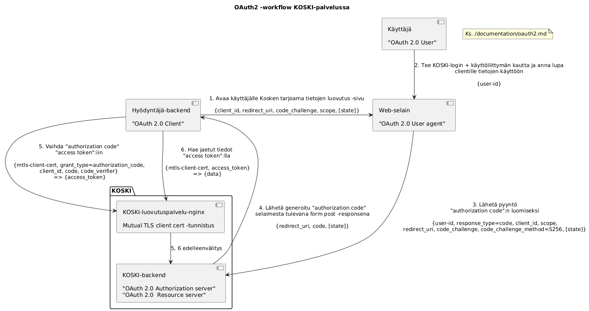
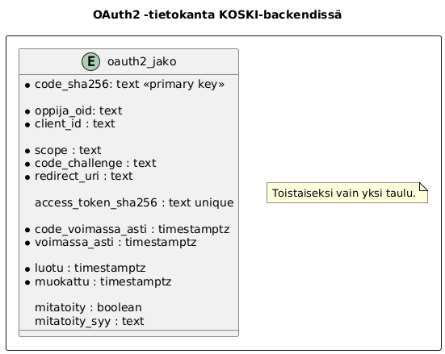

# OAuth 2.0:n käyttöönotto suostumusperusteisessa kansalaisen tietojen luovutuksessa kolmansille osapuolille

## KOSKI-palvelun nykytoteutuksen tukemat tietojenluovutustavat

OPH:n ulkopuolisten osapuolten backendit autentikoituvat Koskeen tällä hetkellä seuraavilla tavoilla:
- (A1) Basic auth: opintohallintojärjestelmät
- (A2) Client cert: KOSKI-luovutuspalvelu, jota käyttävät mm. Kela ja vastaavat viranomaiset
- (A3) Palveluväylä: HSL, DVV

Käyttäjä voi antaa ja tallentaa KOSKI-järjestelmään luvan kaikkiin kyseiselle osapuolelle OPH:n ja osapuolen valisessä
tietoluovutussopimuksessa sovittuihin tietoihin:
- (B1) HSL:n mobiili-applikaatiota varten tehtyjen käyttöliittymien ja backendin kautta

Käyttäjä voi itse rajoittaa ja määritellä tarkemmin jakamansa tietosisällön osajoukoksi KOSKI-dataansa:
- (C1) Luomalla KOSKI-järjestelmän Oma Opintopolku -käyttöliittymässä jakolinkin (URL), jonka
hän voi toimittaa esim. sähköpostitse tai johonkin copy-pasteamalla haluamilleen tahoille

Uusi tapa, joka esim. digilompakkoa ja muita vastaavia palveluita varten tarvitaan on yhdistelmä näiden jo
toteuttamista asioista, eli:
- kolmannen osapuolen palvelun pitää käyttää KOSKI-järjestelmää autentikoituna ja tunnistettavana (kuten A1-A3)
- hyväksyntä-käyttöliittymät loppukäyttäjälle kuten HSL:n tapauksessa (B1)
- mahdollisuus rajoittaa ja valita haluttu osuus tietosisällöstä, kuten jakolinkillä (C1)

## Toteutusehdotus

Ehdotus on käyttää OAuth 2.0 -standardin mukaista authorization code -flowta, käyttäen backendien väliseen autentikointiin
olemassaolevaa KOSKI-luovutuspalvelun tukemaa Mutual TLS (MTLS) client certificate -tunnistusta:

[oauth2.puml](kuvat/oauth2.puml)
[png/oauth2.png](kuvat/png/oauth2.png)
[svg/oauth2.svg](kuvat/svg/oauth2.svg)

[oauth2tietokanta.puml](kuvat/oauth2tietokanta.puml)
[png/oauth2tietokanta.png](kuvat/png/oauth2tietokanta.png)
[svg/oauth2tietokanta.svg](kuvat/svg/oauth2tietokanta.svg)

## Toteutusehdotuksen arkkitehtuuripäätökset

Otsikkoina on ehdotettu päätös. Otsikossa kirjaimen lisäksi oleva numerokoodi indikoi, että dokumentoituna otsikon
alla on myös muita hylättyjä vaihtoehtoja.

### (A.1) käyttäjä aloittaa tietojen luovutus -flown client-applikaatiossa.

Tämä on yleinen OAauth 2.0 -toteutus, joka tukee useita käyttötapauksia sellaisenaan. Allaolevat muut vaihtoehdot voi
toteuttaa haluttaessa tämän rinnalle.

(A.2) Tälle toinen/lisävaihtoehto voisi olla, että käyttäjä aloittaa flown ja tekee valinnat KOSKI-palvelun käyttöliittymässä, ja luo
KOSKI-käyttöliittymässä linkin/QR-koodin, jota voi käyttää hyödyntäjän frontendissä. Tässä on vielä seuraavat lisävaihtoehdot:

(A.2.1) Luotu linkki/QR-koodi on pohja-URL, jota Client voi käyttää kuvan vaiheessa 1. Linkki sisältää käyttäjän KOSKI-frontendissa
tekemät scope-valinnat, ja Client lisää siihen query-parametrina oman client-id:n ja redirect-url:in.

(A.2.2) Linkki sisältää suoraan KOSKI-backendiin jo tallennetun authorization code:n, jolla Client voi jatkaa tiedonluovutusprosessia
suoraan kuvan vaiheesta 5. Kun tällaista authorization code:a käytetään ensimmäisen kerran, sidotaan sen käyttö sitä
ensimmäisenä käyttäneeseen Clientiin.

(A.2.3) Kuten edellinen (A.2.2), mutta authorization code sidotaan jo KOSKI-käyttöliittymässä tehtävällä valinnalla ainoastaan yhden valitun
client-id:n käyttöön. Jos (A.2) valitaan, tämä on se, mikä toteutetaan, koska johtaa käyttäjän kannalta kaikkein yksinkertaisimpaan
ja tietoturvallisimpaan lopputulokseen.

### (B.1) Käytetään olemassaolevaa client cert + ip-rajaus -autentikointia backendien välillä

Jotta saadaan käytettyä olemassaolevaa, käytössä toimivaa ja jo ennestään auditoitua tunnistamistoteutusta. Myös access token:illa
tehdyt pyynnöt käyttävät tätä mekanismia.

Tämä vaatii ainakin sen verran työtä nginx-luovutuspalveluumme, että muokataan virhekoodit ja -ilmoitukset OAuth 2.0:n MTLS-autentikointitavan
(https://www.rfc-editor.org/rfc/rfc8705.html) mukaisiksi.

(B.2) Kolmas vaihtoehto tähän autentikointiin olisi: Eräs OAuth 2.0 -standardin tarjoamien keinojen mukainen vaihtoehto
olisi tehdä Hyödyntäjä-backendin tunnistaminen KOSKI-backendissä jaetulla client secret -salaisuudella kuvan stepissä 5.
Ja lisäksi käsitellä stepin 6 access token -pyynnöt ilman erillistä autentikointia. Se olisi luultavasti uusille hyödyntäjille
helpompi ottaa käyttöön, koska niissä voisi käyttää mahdollisesti valmiita OAuth 2.0 -kirjastoja ilman laajennuksia sen
autentikointimekanismiin. Client certtien ylläpito korvautuisi heillä KOSKI-palvelulta saadun client secretin ylläpidolla,
mikä olisi myös mahdollisesti heille yksinkertaisempaa.

KOSKI-backendissä (B.2) olisi työläämpi toteuttaa, koska se vaatisi kokonaan
uuden autentikaatiomekanismin ja client secret -rekisterin ja sen hallinnan lisäämisen
KOSKI-backendiin, mitkä pitäisi luultavasti myös auditoida erikseen. Hallinta voisi toki aluksi olla manuaalista
ilman käyttöliittymiä työmäärän säästämiseksi, mutta manuaalinenkin tapa vaatii jonkin turvallisen tavan välittää client
secretin sisältö hyödyntäjille, mitä client certtejä käytettäessä ei tarvitse tehdä.

KOSKI-backendissä Client:in tunnistamisen client secretillä voisi tehdä edelleen ainakin 2 eri tavalla:

(B.2.1) KOSKI-luovutuspalvelu yhdistää client id + client secret:in johonkin Opintopolun
käyttäjätunnukseen, jota käyttämällä edelleenohjaa liikenteen KOSKI-backendille. Eli samoin
kuin nykyinen luovutuspalvelu tekee client certiä käyttäen. Tämä olisi konsistenttia
nykyisen luovutuspalvelun kanssa ja mahdollistaisi suoraan käyttäjätunnuksen oikeuksien
hallinnan Opintopolun nykyisillä käyttöliittymillä.

(B.2.2) Client kutsuu suoraan KOSKI-backendiä, missä oikeudet tarkistetaan ilman Opintopolku-
loginia. Tämä olisi mahdollisesti pienempitöinen toteuttaa, kun KOSKI-backendissä voisi mahdollisesti
käyttää jotain valmista OAuth 2.0 -toteutuskirjastoa sellaisenaan. Mutta tämä olisi erilainen kuin
mikään KOSKI-backendin jo tukema autentikointitapa. Tämä myös poistaisi (B.2.1):n rajoituksen siitä,
että jokaiselle hyödyntäjälle pitää luoda oma Opintopolun käyttäjätunnus. Ilman käyttäjätunnusta
Opintopolun auditlokitus tai audit-lokien käyttö menisi luultavasti vaikeammaksi, kun pitäisi auditlokittaa
operaatioita muilta kuin Opintopolun käyttäjiltä.

### (C) KOSKI-backend toimii sekä authorization että resource serverinä

Ei erillistä palvelua kummallekaan. Tällä tavalla kaikki authorization codet ja access tokenit sisältävä tietokanta ja niihin liittyvä
toiminnallisuus on vain yhden palvelun hallussa. Ja tämä palvelu on sama, missä vastaava toiminnallisuus
on jo toteutettu muille tiedonluovutustavoille (HSL, linkkijaot).

### (D) Opintopolun Login-viestinvaihto olemassaolevalla mekanismilla

Tämä on jätetty kuvaamatta, loginin oletetaan tapahtuvan olemassaolevalla Oman opintopolun mekanismilla ja sen tukemilla
käyttäjän autentikointitavoilla.

### (E) Käytetään OAauth 2.0:n scopeja jaetun tietosisällön valitsemisessa

Scope voi sisältää esim. opiskeluoikeuden/päätason suorituksen tunnistamiseen riittäviä tietoja, tai olla jokin merkkijono, jolla
jaetaan esim. kaikki käyttäjän valmistuneet tutkinnot.

### (F) Ei tueta scope:n lisärajoittamista access tokeneita pyydettäessä

Teoriassa OAuth 2.0 mahdollistaa myös rajoitetumman scopen erillisten access token:ien luomisen saman
authorization code:n avulla, mutta tämän tukeminen olisi turhaa monimutkaisuutta

### (G) Access tokenien voimassaoloaika on sama kuin authorization codella eikä refresh tokeneita käytetä

Erillisiä refresh tokeneita ei käytetä, koska liikenne backendien välillä autentikoidaan aina client cert:llä (B.1):n mukaisesti.
Jos päätetäänkin tukea muita backendien autentikointitapoja, tulee tämä kuitenkin mahdollisesti toteuttaa.

Käyttäjän tehdessä revoken authorization code:lle, pitää kuitenkin poistaa kaikki sen kautta luodut access tokenit. Hyödyntäjän
käyttöoikeudet voi myös tarvittaessa poistaa luovutuspalvelusta nopeasti muuttamalla käyttäjätunnuksen
käyttöoikeuksia Opintopolussa.

### (H) client id = Hyödyntäjä-backendin client certiin + ip-osoitteisiin KOSKI-konfiguraatiossa sidottu Opintopolun käyttäjätunnus

Ei tarvitse toteuttaa erillistä client id -rekisteriä, kun käytetään samaa merkkijonoa.

Pitää varmistaa, että käytetään vain käyttäjätunnuksia, jotka on helppo välittää query-parametreina URL:ssa.

Opintopolkuun perustetaan lisäksi koodisto, jossa käytössäolevat client id:t on säilötty selväkielisine nimineen. Tällöin niiden
listaaminen tarvittaessa esimerkiksi KOSKI-palvelun käyttöliittymässä on yksinkertaista.

### (I.1) Tehdään OAuth 2.0 -palvelintoteutus itse, ei käytetä valmiita komponentteja

KOSKI-backendiin ei ole tarjolla valmista hyvin olemassoleviin HTTP-palvelin toteutuksiin soveltuvaa ja aktiivisessa ylläpidossa olevaa Scala-kirjastoa.
Tämä aiheuttaa vähän lisätyötä, kun OAuth 2.0:n headerformaatit yms. pitää selvittää ja toteuttaa itse detaljitasolla, mutta toisaalta
meidän ei tarvitse toteuttaa kuin authorization code -flow, joten eri viestinvaihtoja on kuitenkin melko rajallinen määrä.

(I.2) *TODO, tsekkaa Java-kirjastot* Vaikka sopivaa Scala -kirjastoa ei ole löytynyt, pitäisi vielä tarkistaa, löytyisikö jokin valmis
Java-kirjasto, jonka voisimme ottaa käyttöön.

### (J) Vaaditaan clienteilta PKCE:n toteuttaminen authorization code:n luomisessa

PKCE (The Proof Key for Code Exchange) käytettäessä ei tarvitse tietoturvan vuoksi rekisteröidä Client:ien sallittuja redirect URI -parametreja
KOSKI-backendin puolelle. Estää myös tietyt tietoturvahyökkäykset ja toteutus tukee valmiiksi mahdollista laajentamista stand-alone mobiili-
tai web-clienteille, jos sellaisia halutaan tulevaisuudessa tukea.

### (K) Ei yritetä yhdistää toteutusta OPH Yleiskäyttöisten palveluiden suunnittelemaan machine-to-machine OAuth 2.0 -autentikointiuudistukseen

machine-to-machine on eri flow kuin authorization code, ja sitä joka tapauksessa vasta suunnitellaan eikä toteuteta.

### (L.1) Järjestelmän jatkuvaa testaamista tukemaan HSL:n mekanismin toteutus muutetaan KOSKI-palvelussa sisäisesti käyttämään OAuth 2.0 -luovutusta

HSL:n ei tarvitsisi tehdä muutoksia, mutta KOSKI-tiimissä OAuth 2.0 :lla olisi aktiivista jatkuvaa käyttöä. Tätä toteutettaessa testaisimme
järjestelmän myös simuloimalla jotain Client:ia tuotantoympäristössä, mikä meidän pitää joka tapauksessa itse toteutusvaiheessa tehdä jollain
tavalla, jotta varmistumme API:n standardinmukaisuudesta yms. Tämä myös parantaa API:a "eat your own dogfood" -periaatteen mukaisesti: hyvä
tapa tehdä toimivia ja hyviä rajapintoja on se, että rajapinnan toteuttajankin on pakko käyttää sitä itse.

Tämä tarkoittaisi, että HSL-ratkaisun nyt käyttämä sovitinpalvelu pitäisi muuttaa tilalliseksi komponentiksi oppija -access token -sidosten ja
code_challenge + -verifier:ien tallentamiseksi. Nykyinen HSL:lle erillisessä lambdassa tehtävä opiskeluoikeustietojen rajoitus -logiikka
pitäisi myös siirtää KOSKI-backendiin yhdeksi mahdolliseksi "scope":ksi tietojenluovutuksessa, mitä on suunniteltu tehtäväksi muutenkin.
Tämä myös yksinkertaistaisi HSL-logiikan ylläpitoa, ja tämän tekemisen jälkeen olisi HSL:nkin helppo siirtyä halutessaan ja
lain/sen tulkintojen salliessa tähän ilman palveluväylää toimivaan tietojenluovutustapaan.

(L.2) Jos tämä osoittautuu liian haastavaksi, niin voidaan myös tehdä vain testi-client. Joka tapauksessa on hyvä testata järjestelmä esim.
pienellä node-applikaatiolla, joka pyörii vähintään testiopintopolussa.

### (M) KOSKI-palvelussa tallennetaan tieto siitä, mitä scope:ja kullakin client_id:llä on lupa käyttää

Tämä monimutkaistaa vähän toteutusta, mutta tällä saadaan teknisesti rajoitettua tiedon jakamista osapuolille, joilla ei ole tiedon käyttöön
pätevää syytä. Esimerkiksi digilompakko-applikaatio voidaan rajoittaa hakemaan vain valmistuneita toisen asteen tai myöhempiä tutkintoja, eikä
niiden kehittäjällä ole siten pääsyä käyttäjän perusopetuksen tai keskeneräisiin opintoihin, vaikka käyttäjä luvan olisi valmis antamaankin.

Tämä kannattanee toteuttaa niin, että sallitut scope:t on sidottu tiettyihin käyttöoikeusrooleihin, joita client-id:tä vastaavilla Opintopolun
käyttäjillä on. Jos käyttöoikeusroolit ohittavaa hienojakaistamista tarvitaan, voi tutkia, saisiko listan sallituista scope:eista
tallennettua suoraan koodiston yhteyteen (ks. H).

### (N.1) Client-applikaatio varmistaa käyttäjän identiteetin datan mukana välitettävän käyttäjän tunnisteen avulla

Tämä varmistaminen pitää tehdä, jotta käyttäjä ei voi tehdä kuvan vaiheen 2 tunnistautumista jonain muuna henkilönä kuin henkilö, jonka
tietoja Client:ssa on tarkoitus käyttää. Eli käyttäjä ei esim. voi yrittää käyttää toisen henkilön tutkintotodistusta itse digilompakon kautta. Tämä toteutetaan niin,
että datan sisältönä on varsinaisten opintotietojen lisäksi Clientin käyttötapaukseen riittävän tarkkuuden henkilötiedot (OPH:n oppijanumero, nimi + syntymäaika tai hetu). Client
voi sitten verrata näitä tietoja itsellään oleviin henkilötietoihin ja joko hyväksyä tai hylätä datan käytön.

Yleiseurooppalaisen käyttäjän tunnistamishaasteeseen ei tässä ratkaisussa oteta kantaa, KOSKI-palvelu välittäisi toistaiseksi vain Opintopolun
oppijanumerorekisterissä jo olevia henkilötietoja.

(N.2) Eräs toinen vaihtoehto voisi olla, että käyttäjän tunnisteet enkoodattaisi ja kryptattaisi jossain spesifoidussa formaatissa
osaksi code_challenge:ä vaiheissa 1 ja 3, ja KOSKI-palvelu vertailisi sitten tätä tietoa vaiheessa 4 code_verifier:in avulla. Tällöin henkilötietoja ei
tarvitsisi välittää lainkaan itse datassa. Tämä olisi kuitenkin OAauth 2.0 -standardin authorization code flown oma laajennus, joka monimutkaistaisi toteutusta.
Ja koska tämä on oma laajennus, pitäisi sen tietoturvavaikutukset ja mahdolliset hyökkäysvektorit pohtia tarkasti, jos tätä halutaan harkita.
