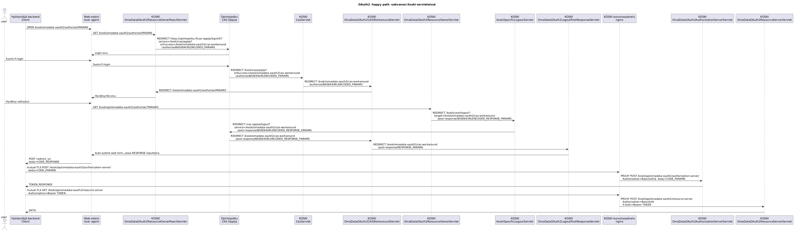

# OAuth 2.0:n toteutus Koskessa

Katso myös [oauth2.md](oauth2.md)

## Uusien palveluntarjoajien lisääminen

Nykytoteutuksessa ei ole mitään pääkäyttäjä-käyttöliittymä tms., minkä kautta kaiken konfiguraation voisi tehdä.
Siksi uusia OAuth2-rajapinnan käyttäjiä lisättäessä tietoja pitää konfiguroida moneen eri paikkaan:

(1) Päätä, mikä on uuden palveluntarjoajan käyttäjätunnus, joka on samalla OAuth2 client_id. Esimerkin vuoksi tässä käytetään merkkijonoa <CLIENT_ID>. DVV:n digilompakolle tämä on "dvvdigilompakkopk".

(2) Lisää uusi palvelukäyttäjä, jolla on tämä käyttäjätunnus.

(3) Lisää palvelukäyttäjälle halutut "OmaData OAuth2 scope" -alkuiset Koski-käyttöoikeudet. Tämä voi vaatia uuden käyttöoikeusryhmän luomisen.

(4) Lisää <CLIENT_ID> omadataoauth2client-koodistoon, selväkielisine suomi/ruotsi/englanti-nimineen. Näitä nimiä näytetään kansalaiselle.

(5) Lisää tarvittavat omadataoauth2-käyttöliittymätekstit lokalisaatiopalveluun

    omadataoauth2_linkki_<CLIENT_ID>                                    Linkki sivustolle, josta kansalainen saa suostumusdialogilta lisää tietoa palveluntarjoajasta
    omadataoauth2_linkkiteksti_<CLIENT_ID>                              Teksti, jolla linkki näytetään suostumuskäyttöliittymässä
    omadataoauth2_tekstikappale_<CLIENT_ID>_1                           Ensimmäinen tekstikappale suostumuskäyttöliittymässä
    omadataoauth2_tekstikappale_<CLIENT_ID>_2                           Toinen tekstikappale suostumuskäyttöliittymässä
    omadataoauth2_tekstikappale_<CLIENT_ID>_...                         ..., tekstikappaleita voi määrittää haluamansa määrän

(6) Selvitä tarvittavat paluuosoitteet, ja konfiguroi ne <CLIENT_ID>:lle Koski-palvelun AppConfigiin (ks. reference.conf omadataoauth2-osuus)

(7) Selvitä luovutuspalveluun tarvittava mutual-TLS client certin subject distinguished name ja palveluntarjoajan IP-osoitteet, ja konfiguroi ne parameter storeen

(8) Konfiguroi luovutuspalveluun palvelukäyttäjän <CLIENT_ID> salasana

(9) Käynnistä KOSKI ja luovutuspalvelu uudestaan konfiguraatioiden lataamiseksi

(10) Testaa fronttia (ks. testi-URI-esimerkkejä tämän ohjeen lopusta)

## Sekvenssikaavio toteutuksen toiminnasta

[oauth2sekvenssiservleteissa.puml](kuvat/oauth2sekvenssiservleteissa.puml)
[png/oauth2sekvenssiservleteissa.png](kuvat/png/oauth2sekvenssiservleteissa.png)
[svg/oauth2sekvenssiservleteissa.svg](kuvat/svg/oauth2sekvenssiservleteissa.svg)

    PARAMS:
    client_id             Esim. dvvdigilompakkopk
    redirect_uri          <DVV:n kertoma ja Koskeen rekisteröity callback-URI>
    state
    scope                 Esim. HENKILOTIEDOT_SYNTYMAAIKA HENKILOTIEDOT_NIMI OPISKELUOIKEUDET_SUORITETUT_TUTKINNOT
    response_type         =code
    response_mode         =form_post
    code_challenge_method =S256
    code_challenge
      Virhetilanteissa voi sisältää myös:
    error
    error_id

    RESPONSE_PARAMS:
    client_id
    redirect_uri
    state
    code
      Virhetilanteissa code:n sijasta voi sisältää:
    error
    error_description
    error_uri

    RESPONSE:
    state
    code
      Virhetilanteissa code:n sijasta voi sisältää:
    error
    error_description
    error_uri

    CODE_PARAMS:
    grant_type            =authorization_code
    code
    code_verifier
    redirect_uri
    client_id

    TOKEN_RESPONSE:
    access_token
    token_type        =Bearer
    expires_in

## Integraatiotestit

Ks. [README.md#e2e-testit](../omadata-oauth2-sample/README.md#e2e-testit)

## Infran ylläpito

Ks. [https://github.com/Opetushallitus/koski-aws-infra/blob/master/documentation/oauth2.md](https://github.com/Opetushallitus/koski-aws-infra/blob/master/documentation/oauth2.md).

## Testi-osoitteita

### Localhost

toimiva: http://localhost:7021/koski/omadata-oauth2/authorize?client_id=oauth2client&response_type=code&response_mode=form_post&redirect_uri=%2Fkoski%2Fomadata-oauth2%2Fdebug-post-response&code_challenge=NjIyMGQ4NDAxZGM0ZDI5NTdlMWRlNDI2YWNhNjA1NGRiMjQyZTE0NTg0YzRmOGMwMmU3MzFkYjlhNTRlZTlmZA&code_challenge_method=S256&state=internal%20state&scope=HENKILOTIEDOT_SYNTYMAAIKA%20HENKILOTIEDOT_NIMI%20OPISKELUOIKEUDET_SUORITETUT_TUTKINNOT

toimiva täydellä localhost uri:lla redirect_urissa: http://localhost:7021/koski/omadata-oauth2/authorize?client_id=oauth2client&response_type=code&response_mode=form_post&redirect_uri=http%3A%2F%2Flocalhost%3A7021%2Fkoski%2Fomadata-oauth2%2Fdebug-post-response&code_challenge=NjIyMGQ4NDAxZGM0ZDI5NTdlMWRlNDI2YWNhNjA1NGRiMjQyZTE0NTg0YzRmOGMwMmU3MzFkYjlhNTRlZTlmZA&code_challenge_method=S256&state=internal%20state&scope=HENKILOTIEDOT_SYNTYMAAIKA%20HENKILOTIEDOT_NIMI%20OPISKELUOIKEUDET_SUORITETUT_TUTKINNOT

rikkinäinen client_id : http://localhost:7021/koski/omadata-oauth2/authorize?client_id=eirek_client&response_type=code&response_mode=form_post&redirect_uri=%2Fkoski%2Fomadata-oauth2%2Fdebug-post-response&code_challenge=NjIyMGQ4NDAxZGM0ZDI5NTdlMWRlNDI2YWNhNjA1NGRiMjQyZTE0NTg0YzRmOGMwMmU3MzFkYjlhNTRlZTlmZA&code_challenge_method=S256&state=internal%20state&scope=HENKILOTIEDOT_SYNTYMAAIKA%20HENKILOTIEDOT_NIMI%20OPISKELUOIKEUDET_SUORITETUT_TUTKINNOT

koko putken esimerkkiapplikaatiosta käynnistävä smoke-testi: http://localhost:7051/api/openid-api-test

### Untuva

toimiva https://untuvaopintopolku.fi/koski/omadata-oauth2/authorize?client_id=koskioauth2sampledevpk&response_type=code&response_mode=form_post&redirect_uri=%2Fkoski%2Fomadata-oauth2%2Fdebug-post-response&code_challenge=NjIyMGQ4NDAxZGM0ZDI5NTdlMWRlNDI2YWNhNjA1NGRiMjQyZTE0NTg0YzRmOGMwMmU3MzFkYjlhNTRlZTlmZA&code_challenge_method=S256&state=internal%20state&scope=HENKILOTIEDOT_SYNTYMAAIKA%20HENKILOTIEDOT_NIMI%20OPISKELUOIKEUDET_SUORITETUT_TUTKINNOT

dokumentaatio-draft: https://untuvaopintopolku.fi/koski/dokumentaatio/rajapinnat/oauth2/omadata

koko putken esimerkkiapplikaatiosta käynnistävä smoke-testi: https://oph-koski-omadataoauth2sample-dev.testiopintopolku.fi/api/openid-api-test

### Untuva, DVV:n client:id:llä

untuva testi-uri, dvv:n client_id:llä https://untuvaopintopolku.fi/koski/omadata-oauth2/authorize?client_id=dvvdigilompakkopk&response_type=code&response_mode=form_post&redirect_uri=http%3A%2F%2Flocalhost%3A8380%2Foauth-authorization%2Fapi%2F1.0%2Fauth-callback&code_challenge=NjIyMGQ4NDAxZGM0ZDI5NTdlMWRlNDI2YWNhNjA1NGRiMjQyZTE0NTg0YzRmOGMwMmU3MzFkYjlhNTRlZTlmZA&code_challenge_method=S256&state=internal%20state&scope=HENKILOTIEDOT_SYNTYMAAIKA%20HENKILOTIEDOT_NIMI%20OPISKELUOIKEUDET_SUORITETUT_TUTKINNOT

untuva testi-uri, rikkinäinen redirect_uri, dvv:n client_id:llä https://untuvaopintopolku.fi/koski/omadata-oauth2/authorize?client_id=dvvdigilompakkopk&response_type=code&response_mode=form_post&redirect_uri=http%3A%2F%2Flocalhost%3A8380%2Fauth%2Fapi%2F1.0%2Fauth-callback&code_challenge=NjIyMGQ4NDAxZGM0ZDI5NTdlMWRlNDI2YWNhNjA1NGRiMjQyZTE0NTg0YzRmOGMwMmU3MzFkYjlhNTRlZTlmZA&code_challenge_method=S256&state=internal%20state&scope=HENKILOTIEDOT_SYNTYMAAIKA%20HENKILOTIEDOT_NIMI%20OPISKELUOIKEUDET_SUORITETUT_TUTKINNOT
